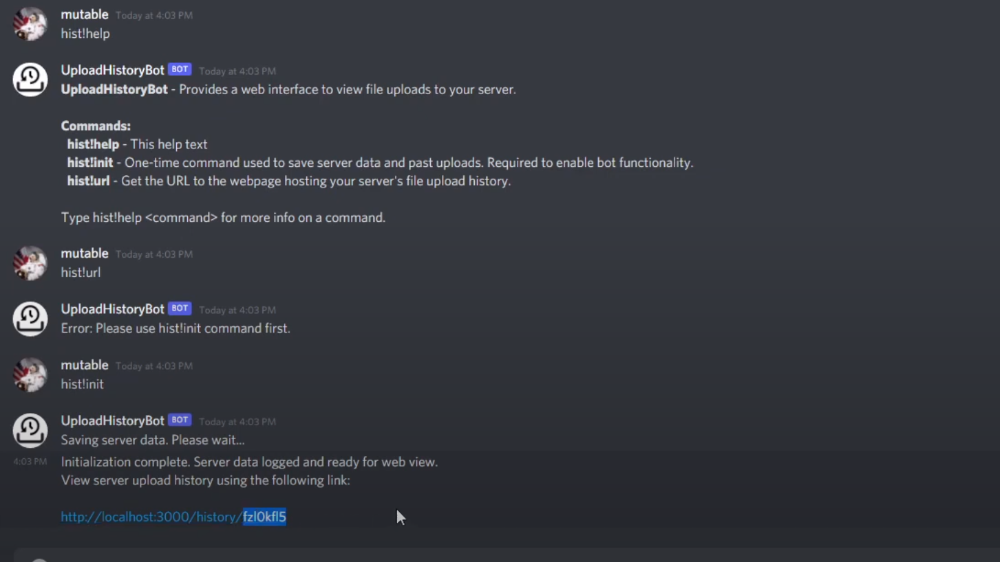
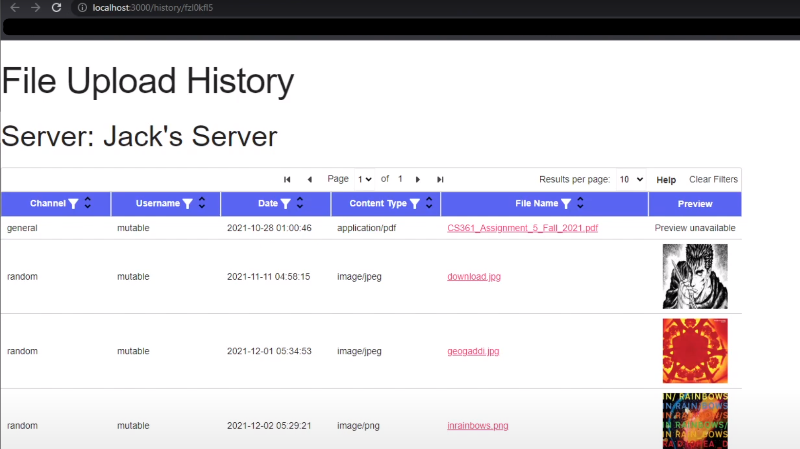

# A Discord File History Bot and Website

The purpose of this project is to provide Discord users an easier way to view the history of files (attachments) uploaded in their server's text channels.

> As the Discord app currently stands, although it's possible to search for and find files, the search interface is small and cumbersome.

### Features
- The bot automatically records message attachment information to a database, and supplies a unique website URL for your discord server.
- The website contains a minimalist table interface to view your server's file uploads, with filter and sorting options.

## Set-up Instructions

The project requires you to have a running MySQL server, and a discord application.  
- Create your discord application here: https://discord.com/developers/applications
- Import the MySQL database using the file in `database/load_db.sql`
- Enter your discord application token and MySQL credentials in `credentials_template.js` then rename it to `credentials.js`
- Install node packages using the script `npm_install.sh`
- To begin the services, execute the script `run_all.sh`

> This repo contains four independently run services: The web server, bot server, and two microservices found in `microservices/`.  
The microservices were originally authored by team members in an academic group setting. The original repos are here:  
https://github.com/danwsc09/cs361-microservice  
https://github.com/kange873/CS361-Microservice

### Bot commands

- hist!help : Displays help information
- hist!init : Initializes bot functionality
- hist!url : Displays the URL to your server's webpage

## Preview

### Video Demo: https://youtu.be/lQe4rczHhVA

#### Discord Interface

#### Website Interface

